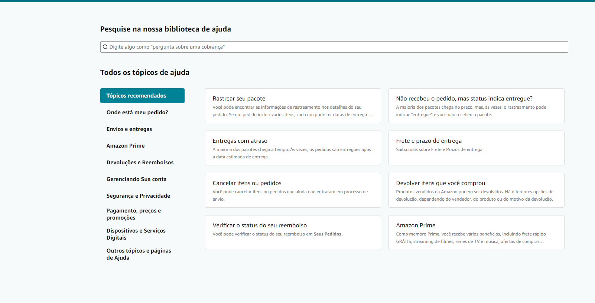
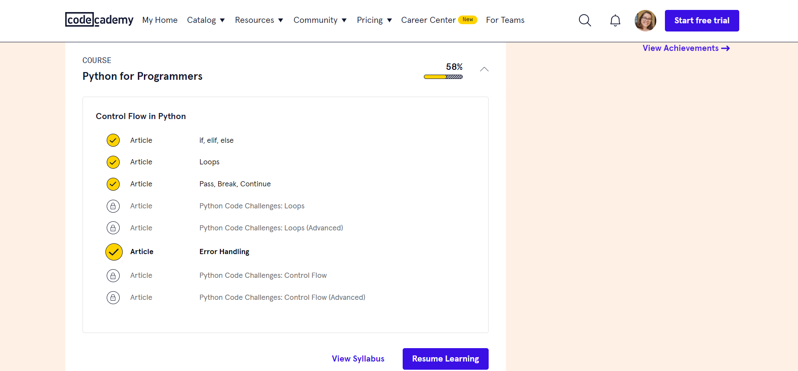
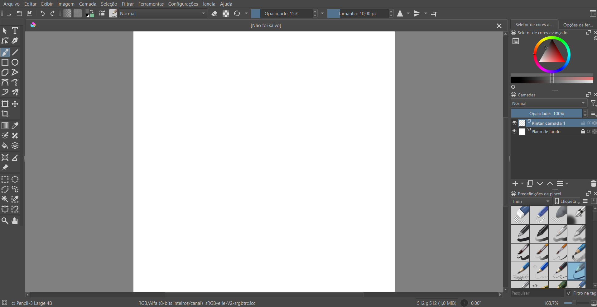
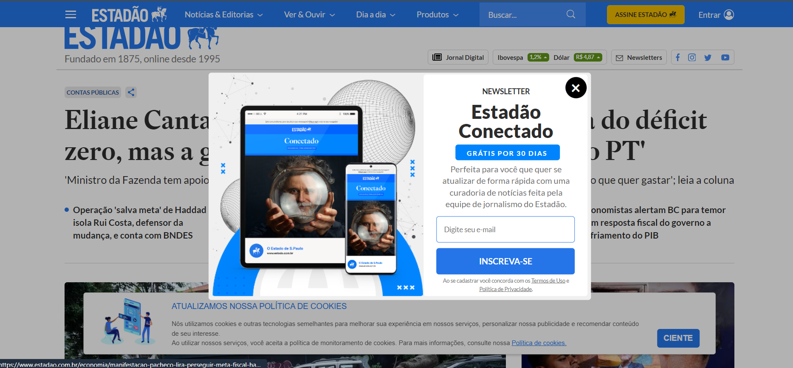

# Análise das heurísticas para design de interface de usuário

## acertos

<h3><strong>Amazon:</strong> Ajuda e documentação<h3>

A Amazon oferece uma seção de perguntas frequentes (FAQ) e tutoriais para orientar os usuários sobre como usar o site.

 

<h3><strong>Instagram:</strong> Correspondência entre o sistema e o mundo real<h3>

Com os ícones, as redes sociais se tornam mais intuítivas e mais fácil de navegar para os usuários.

 

<h3><strong>Code Academy:</strong> Visibilidade do status do sistema<h3>

Os usuários recebem informações sobre o avanço em cursos, atividades e conquistas, garantindo um retorno claro sobre seu desempenho.

 

## erros

<h3><strong>Krita:</strong> Flexibilidade e eficiência de uso<h3>

Para quem está começando, usar todas as funcionalidades é complicado porque a interface não é muito intuitiva.

 

<h3><strong>Estadão:</strong> Estética e design minimalista:<h3>

Muitos anúncios pop-up são exibidos ao acessar notícias, prejudicando a estética da página e interferindo na experiência de leitura.

 

<h3><strong>Disney Plus:</strong> Correspondência entre o sistema e o mundo real<h3>

A falta de suporte a múltiplos idiomas compromete o uso do sistema, tornando a interface menos alinhada com a diversidade linguística dos usuários.

 

